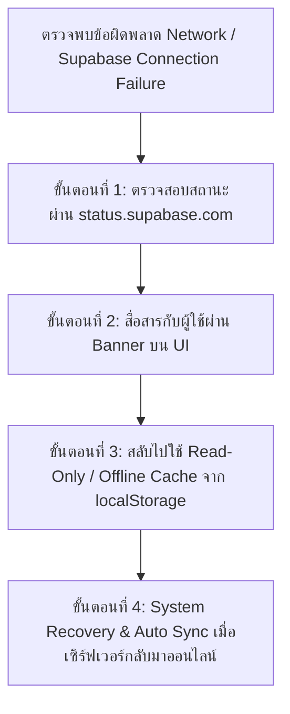

# 🚜 FarmPro Application

ระบบบริหารจัดการลานรับซื้อยางพาราและชาวสวนยางแบบดิจิทัล (Digital Rubber Procurement & Farm Management Platform)

---

## 📌 สถาปัตยกรรมระบบ & ฟีเจอร์หลัก (Key Features & Architecture)

- **Authentication & Security System**: ระบบเข้าสู่ระบบและสมัครสมาชิกด้วยเบอร์โทรศัพท์และรหัสผ่าน (Phone + Password Auth) พร้อมการจัดการ Error UI ป้องกันไม่ให้แอปพลิเคชันเกิดการค้าง (Freeze) หรือ Unhandled Promise Rejection
- **Offline First & Stale-While-Revalidate (SWR)**: โหลดข้อมูลรวดเร็วแบบ Instant Render จาก `localStorage` แล้วดึงข้อมูลอัปเดตเบื้องหลัง (Background Sync) จาก Supabase
- **Security & Data Privacy Rule**: ปฏิบัติตามมาตรฐานความปลอดภัย [SECURITY RULE] โดยห้ามบันทึกรหัสผ่านตัวเต็ม (Plain Text Password) ลง `localStorage` โดยเด็ดขาด (ใช้ระบบ Password Hashing สำหรับข้อมูลจำลอง)

---

## 🛠️ Production Monitoring & Incident Response

มาตรฐานการติดตามระบบ (System Health Monitoring) และคู่มือแผนปฏิบัติการฉุกเฉินเมื่อบริการฐานข้อมูล Supabase เกิดการขัดข้องหรือล่ม (Supabase Outage)

### 1. System Health Monitoring (การติดตามสถานะระบบ)
- **Supabase Official Status Dashboard**: [https://status.supabase.com](https://status.supabase.com)
  - ใช้สำหรับตรวจสอบสถานะความพร้อมของบริการ Supabase (Database Engine, Auth Services, REST/Realtime API, Storage)
- **Network & API Monitoring Channels**:
  - **Client Connection Status**: ตรวจสอบสถานะการเชื่อมต่อเครือข่ายฝั่งอุปกรณ์ผู้ใช้ผ่าน `window.navigator.onLine`
  - **API Health Check & Latency**: ดักจับ HTTP Network Errors (เช่น `TypeError: Failed to fetch`, `500 Server Error`, `503 Service Unavailable`) ระหว่าง React Client และ Supabase Endpoint

---

### 2. Emergency Operating Procedure (แผนรับมือเมื่อ Supabase Outage / ล่ม)



#### 🔹 ขั้นตอนที่ 1: การตรวจสอบและยืนยันสาเหตุ (Verification)
1. เข้าไปที่ [https://status.supabase.com](https://status.supabase.com) เพื่อตรวจสอบว่าปัญหาเกิดจากโครงสร้างพื้นฐานของ Supabase (Database/Auth Outage) หรือเกิดจากเครือข่ายฝั่งผู้ใช้งาน
2. ตรวจสอบ Browser Console Logs หากพบข้อผิดพลาดประเภท Connection Failure หรือ Timeout ให้ระบุสถานะเป็น **Database Service Interruption**

#### 🔹 ขั้นตอนที่ 2: การสื่อสารกับผู้ใช้งาน (User Communication)
1. แสดงผล **Offline / Maintenance Banner** บนส่วนบนของแอปพลิเคชัน (`OfflineStatusBar.jsx`) ทันที
2. ข้อความแจ้งเตือนบน Banner:
   > 📡 **ขณะนี้คุณกำลังใช้งานในโหมดออฟไลน์ (แสดงข้อมูลจากแคชในอุปกรณ์)**
3. แสดง Alert / Toast Notification เมื่อเกิดข้อผิดพลาดในการเข้าสู่ระบบหรือสมัครสมาชิก:
   > ⚠️ **ไม่สามารถเชื่อมต่อเซิร์ฟเวอร์ได้ กรุณาตรวจสอบการเชื่อมต่ออินเทอร์เน็ตหรือลองใหม่อีกครั้ง**

#### 🔹 ขั้นตอนที่ 3: การทำงานในโหมด Read-Only / Offline Cache
1. แอปพลิเคชันจะใช้กลยุทธ์ **Local Cache Fallback** ดึงข้อมูล Profile และ Transaction ล่าสุดจาก `localStorage` (`farmpro_profile`, `farmpro_transactions`) ขึ้นมาแสดงผลบนหน้า Dashboard และ Portal ต่างๆ
2. ผู้ใช้ยังคงสามารถดูข้อมูลโปรไฟล์ สถิติ และประวัติรายการย้อนหลังได้ตามปกติโดยที่แอปพลิเคชันไม่พัง (Zero App Crash / Freeze)
3. รายการใหม่ที่สร้างขึ้นในขณะออฟไลน์จะถูกเก็บเข้าคิวรอซิงค์ (`farmpro_pending_sync`)

#### 🔹 ขั้นตอนที่ 4: ขั้นตอนการ Sync ข้อมูลกลับ (System Recovery & Sync)
1. เมื่อบริการ Supabase และการเชื่อมต่ออินเทอร์เน็ตกลับมาเป็นปกติ (`navigator.onLine === true`)
2. ระบบ Background Worker จะทำการส่งข้อมูลที่ค้างอยู่ในคิว `farmpro_pending_sync` อัปโหลดไปยัง Supabase อัตโนมัติ (Background Auto-Sync)
3. อัปเดตข้อมูล State บน UI และรีเฟรช LocalStorage Cache ให้เป็นปัจจุบันเสมอ

---

## 🚀 การติดตั้งและรันโครงการ (Getting Started)

```bash
# ติดตั้ง Dependencies
npm install

# รัน Development Server
npm run dev

# ทดสอบ Build สำหรับ Production
cmd /c "npm run build"
```
